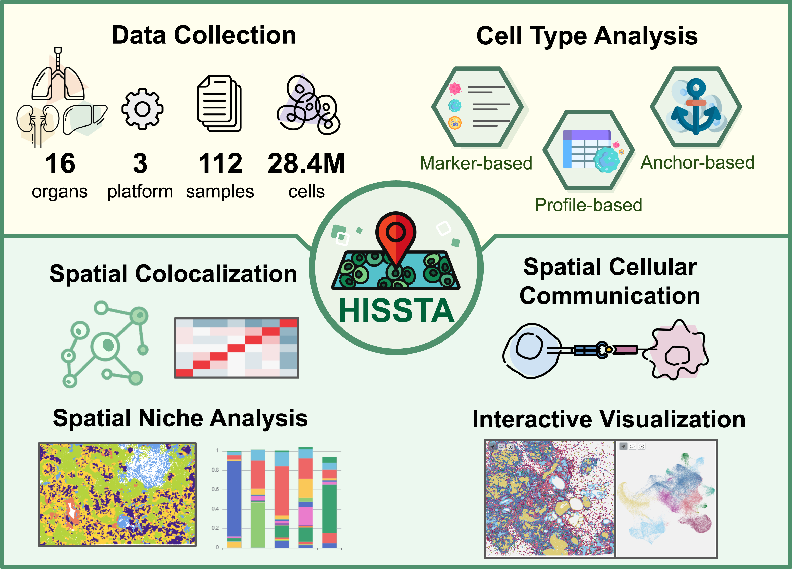

# HISSTA
HISSTA: a Human In Situ Single-cell Transcriptome Atlas

The HISSTA database includes spatial single-cell transcriptome data from various human tissues, utilizing primary techniques such as MERFISH (Vizgen), CosMx (Nanostring), and Xenium (10x) to achieve genuine single-cell resolution in situ. We support the exploration of datasets, preliminary analysis results, and interactive visualization with Vitessce.

https://kbds.re.kr/hissta/

